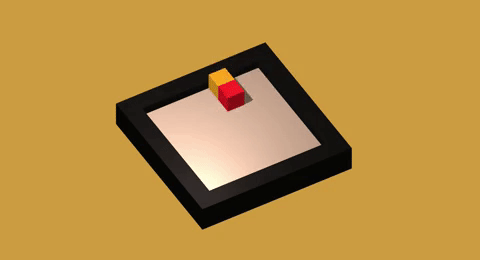

# Q-Learning in Unity

A simple example implementation of Q Learning in Unity. To solve the the RL problem, an agent needs to learn to take the best action in each of the possible states it encounters. For that, the Q-learning algorithm learns how much long-term reward it will get for each state-action pair (s, a). 


### Example




## The Q Learning Algorithm

```csharp
int action;

if (Random.Range(0f, 1f) < ExplorationFactor)
{
    action = Random.Range(0, 4); //Exploration
}
else
{
    //Exploitation
    action = QTable[currentState].ToList().IndexOf(QTable[currentState].Max());
}

//Execute Action (Step the Environment)
var envResult = AgentMover.Move(action); 


oldQValue = QTable[currentState][action]; //Old Value in Q-Table
var nextMax = QTable[envResult.state].Max(); //Best Value for next state

//Calculate new Q-Value
var newQValue = oldQValue + LearningRate * (envResult.reward + DiscountFactor * nextMax - oldQValue);
QTable[currentState][action] = newQValue;

currentState = envResult.state;
```

 

The core of the algorithm is based on this equation:


